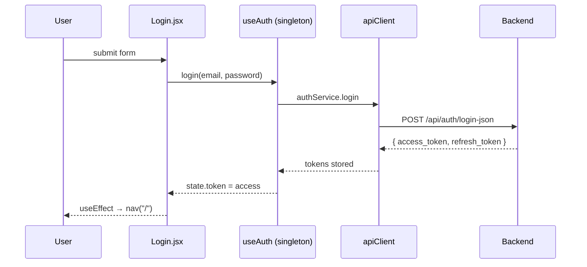

# Frontend guide

Vite + React 18 + React Router v6 + Zustand. The whole SPA is ~16 files.

## Stack

| Library | Version | Why |
|---|---|---|
| `react` | 18.3 | UI |
| `react-dom` | 18.3 | DOM renderer |
| `react-router-dom` | 6.27 | Client-side routing + `?next=` redirects |
| `zustand` | 4.5 | Tiny global store for the chat list |
| `vite` | 5.x | Dev server + bundler |

No CSS framework; we ship a small `styles.css` with CSS variables. No TypeScript in Phase 1.

## File map

```
frontend/
├── package.json
├── vite.config.js          # dev proxy to backend
└── src/
    ├── main.jsx            # ReactDOM root, AuthBoundary, BrowserRouter
    ├── App.jsx             # Routes, Protected wrapper, isSafeNext helper
    ├── styles.css
    ├── hooks/
    │   ├── useAuth.js      # Singleton auth state (useSyncExternalStore)
    │   └── useChatStream.js# SSE consumer
    ├── services/
    │   ├── apiClient.js    # fetch wrapper, 401 → ATH_EVENT, AbortController
    │   ├── authService.js
    │   └── docService.js
    ├── store/
    │   └── chatStore.js    # zustand: conversations, messages, optimistic
    └── pages/
        ├── Login.jsx
        ├── DocumentManager.jsx
        └── ChatInterface.jsx
```

## State architecture

There are two orthogonal state systems:

1. **Auth** — a module-level singleton in `useAuth.js`. Exposed via `useAuth()` hook which uses `useSyncExternalStore`. The store is shared by every consumer; login/logout flips it atomically.
2. **Chat** — a `zustand` store (`chatStore.js`) that holds the conversation list, the active conversation, and its messages. Used by both `DocumentManager` (sidebar nav) and `ChatInterface` (the chat view).

Local state (e.g. `input` in the composer, `filter` in the document list) lives in `useState` on the component.

## Auth flow



On 401 (anywhere), `apiClient` dispatches `athena:auth-failed` on `window`. `AuthBoundary` (in `main.jsx`) listens and navigates to `/login?next=…` via React Router, preserving the current path so the user returns to the same page after re-auth.

## SSE consumer

`useChatStream` opens a `fetch` with an `AbortController` and reads the response body as a `ReadableStream`. It:

1. Buffers incoming bytes.
2. Splits on `\n\n` or `\r\n\r\n` (some proxies emit CRLF).
3. Parses each `data: <json>` line.
4. Maps event types to local state (`RUN_STARTED` → `setRunId`, `TEXT_MESSAGE_CONTENT` → `setText(t => t + delta)`, etc.).
5. Cleans up in `finally` — `setDone(true)`, `releaseLock()` on the reader, clearing the in-flight ref.

It also exposes a `cancel()` method used by the chat page's unmount cleanup:

```jsx
useEffect(() => () => stream.cancel(), [stream]);
```

## Optimistic UI

`ChatInterface.onSend`:

1. `appendMessage` an optimistic user message (with a temp id from `crypto.randomUUID()`).
2. `stream.send(...)` — the LLM streams.
3. After `RUN_FINISHED`, `appendMessage` the assistant text.
4. `refreshActive()` — re-fetches the conversation from the server and merges by id, replacing temp ids with real ones.

`chatStore.appendMessage` dedupes by id, so the stream's `setText` re-renders don't produce duplicate rows.

## Document polling

`DocumentManager` polls `GET /api/documents` adaptively:

- Every 2s when any document is `uploaded` or `processing`.
- Every 15s otherwise.
- Pauses on `document.visibilitychange === 'hidden'`.

The polling `useEffect` is a `setTimeout` self-rescheduling chain, and it always reads the latest `loadRef.current` so it doesn't capture a stale closure (the original bug here was a `setInterval` that called the first-render `load`).

## Vite dev proxy

`vite.config.js` proxies `/api`, `/health`, `/model`, `/metrics` to the backend (`VITE_API_TARGET` env or `http://localhost:8000`). The dev server runs on `:5173`. The frontend never has to think about CORS in dev.

In production, you serve the built bundle from nginx (`infra/nginx.conf`) and let it reverse-proxy to the FastAPI app.

## Adding a page

1. Create `src/pages/MyPage.jsx`.
2. Add a route in `App.jsx`:
   ```jsx
   <Route path="/my-page" element={<Protected><MyPage /></Protected>} />
   ```
3. Add a sidebar link in the pages that need it.

The `Protected` wrapper reads the auth singleton. The `useAuth` hook works from anywhere.

## Adding a tool

1. `POST /api/tools` with the JSON schema + handler cfg.
2. The tool appears in the orchestrator's next request (snapshot cache is invalidated on upsert).
3. If the LLM calls it, you'll see `TOOL_CALL_*` events on the SSE stream.

## Production build

```bash
cd frontend
npm run build    # → dist/
npm run preview  # serve the built bundle locally
```

The `dist/` output is static; serve it from any HTTP server. Pair it with `infra/nginx.conf` for the production reverse proxy.
